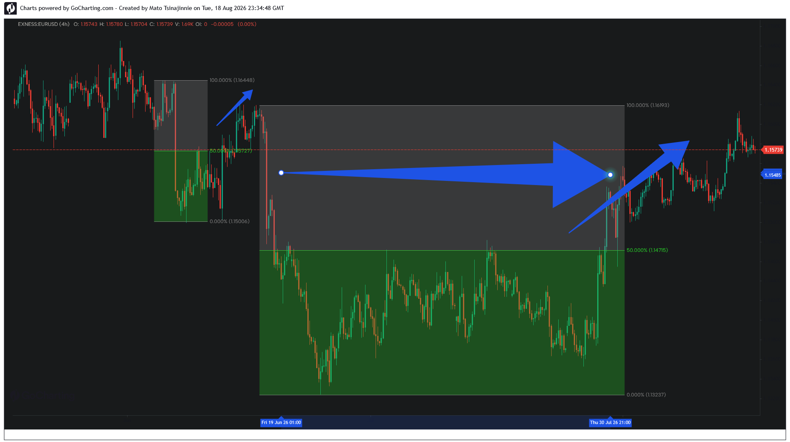
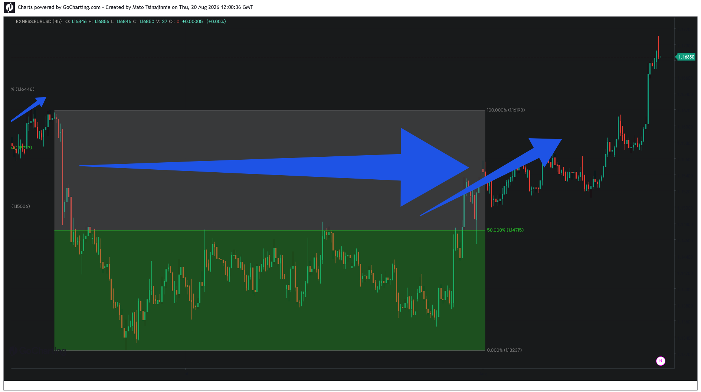

### 📂 Case Study 02: EURUSD — Multi-Week Induced Distribution & Macro Rebalancing

#### Phase 1: Range Formation & Equilibrium Identification

#### Phase 2: Algorithmic Delivery Continuation (Live Update)

*   **Asset:** EURUSD (4H)
*   **Structural Context:** Macro Pricing Asymmetry
*   **Distribution Horizon:** ~6 Weeks (Consolidation Phase)
*   **Execution Target:** Dynamic 50% Equilibrium Level (1.14715)

**Analysis:**
This case highlights a macro-scale liquidity expansion anomaly where price engineered an extended 6-week retail inducement window below the baseline equilibrium line. The prolonged consolidation inside the discount parameters (green zone) systematically generated a counter-trend narrative for retail participants. 

The structural mitigation engine concluded the cycle with a high-momentum expansion vector delivering the price straight back to the geometric pivot zone, clearing the accumulated liquidity and resolving the prolonged market efficiency gap.

**Market Evolution (Online Update):**
Subsequent live price action confirms the absolute validity of the 50.00% Equilibrium level at **1.14715**. Following the initial sweep out of the green accumulation profile, the algorithmic engine executed an aggressive, uninterrupted buying vector (blue arrow sequence). The pricing delivery bypassed minor retail overhead resistances and extended far beyond the 100.00% macro boundary (1.16103). This clean breakout showcases how long-term structural distribution serves as prime fuel for sustained institutional expansion.
