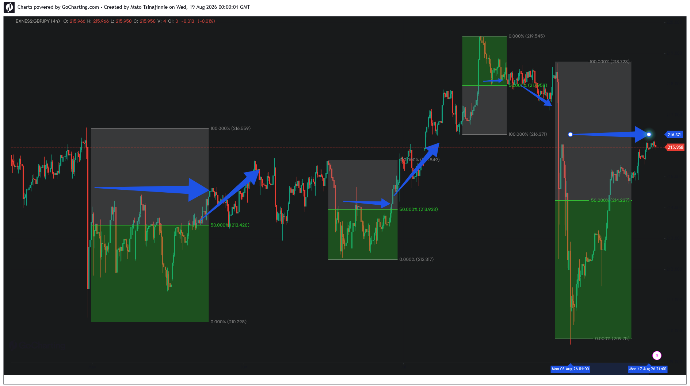

### 📂 Case Study 05: GBPJPY — High-Volatility Asymmetry and Macro Crisis Rebalancing

*   **Asset:** GBPJPY (4H)
*   **Structural Context:** Extreme Volatility / Macro Expansion Event
*   **Pattern Type:** Crisis-Induced Order-Flow Imbalance
*   **Execution Target:** 50% Equilibrium Pivot (215.919 / 216.371)

**Analysis:**
This case study provides an empirical validation of the equilibrium hypothesis under conditions of extreme market stress and high-velocity price action. Following a sustained multi-block ascending matrix, the asset experienced an anomalous macroeconomic liquidation event (the late-July contraction vector). 

The massive displacement bar generated a severe structural pricing asymmetry. While traditional lagging technical indicators interpreted the aggressive downside delivery as a permanent structural break, the algorithmic liquidity engine stabilized inside the deep discount architecture (green zone) before executing a comprehensive mean-reversion sequence. Price was delivered precisely back to the 50.00% geometric midpoint, confirming that even extreme momentum vectors remain subject to the structural laws of equilibrium rebalancing.
