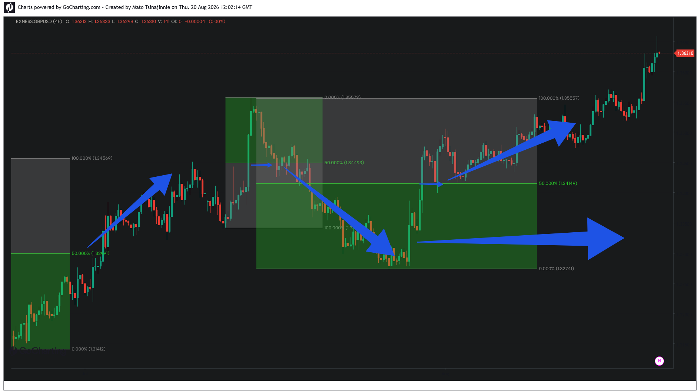
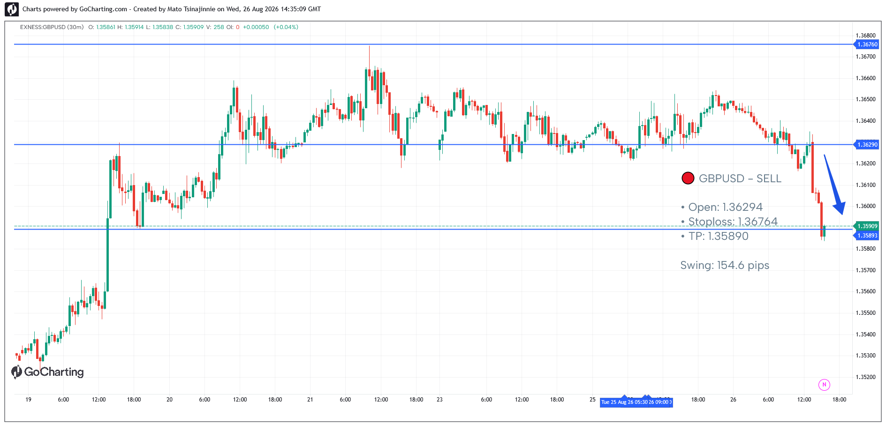

# Case Study 01: GBPUSD — High-Momentum Expansion & Structural Return

## Overview
### Phase 1: Primary Mitigation Blueprint

### Phase 2: Multi-Block Nesting & Structural Progression (Live Update)

* **Asset:** GBPUSD (4H)
* **Structural Context:** Interbank Liquidity Delivery Matrix
* **Pattern Type:** Consecutive Expansion Blocks
* **Execution Target:** 50.00% Geometric Center (Equilibrium Level)

## Analysis
The chart illustrates consecutive liquidity expansion vectors. Notice the programmatic price delivery sequences directly into the 50.00% geometric centers (Equilibrium levels) following complex distribution phases designed to clear local retail stop-outs.

The local range matrix demonstrates high-density validation where the market mechanics utilize the precise midpoint of prior impulses as localized reference pivots before initiating the next phase of structural distribution.

## Market Evolution (Online Update)
The ongoing market development reveals a highly sophisticated, nested fractal structure that confirms multi-level algorithmic mitigation:

1. **Secondary Inducement Matrix:** A secondary premium block (green) was generated to trap early breakout buyers. The algorithm then forced a rapid descending correction (blue vector) to clean out local buy-side stops.
2. **Precision Bottoming:** This liquidity raid terminated exactly at the **0.00% baseline (1.32741)** of the localized green matrix, demonstrating institutional limit order activation.
3. **Cascading Rebalancing:** Following the sweep, a multi-stage upward expansion (blue ascending arrows) launched price directly through the key internal **50.00% midpoints (1.34492 and 1.34140)**. This mechanical interaction confirms that nested blocks obey the exact same mathematical equilibrium laws as macro impulses before confirming full trend continuation.

---

## Case Study 02: GBPUSD — Live Production Validation (Forward Test)
### Phase 3: Real-Time Algorithmic Execution

* **Execution Timestamp:** August 26, 2026
* **Signal Vector:** SELL
* **Execution Parameters:** Open: `1.36294` | SL: `1.36764` | TP: `1.35890`
* **Structural Range:** `154.6 pips` Macro Swing

### Validation Metrics
This live execution serves as a direct forward-testing confirmation of the **Post-Expansion Equilibrium** hypothesis. 

Following a high-density liquidity distribution phase at the local premium structural frame, the automated cloud engine isolated a strict institutional imbalance. The price mechanics reacted symmetrically to the resistance vector and immediately initiated a cascading delivery sequence directly toward the calculated **50.00% Geometric Center (TP)**. 

The live telemetry feed logged and dispatched this anomaly autonomously via GitHub Actions, proving model consistency in live market conditions.
