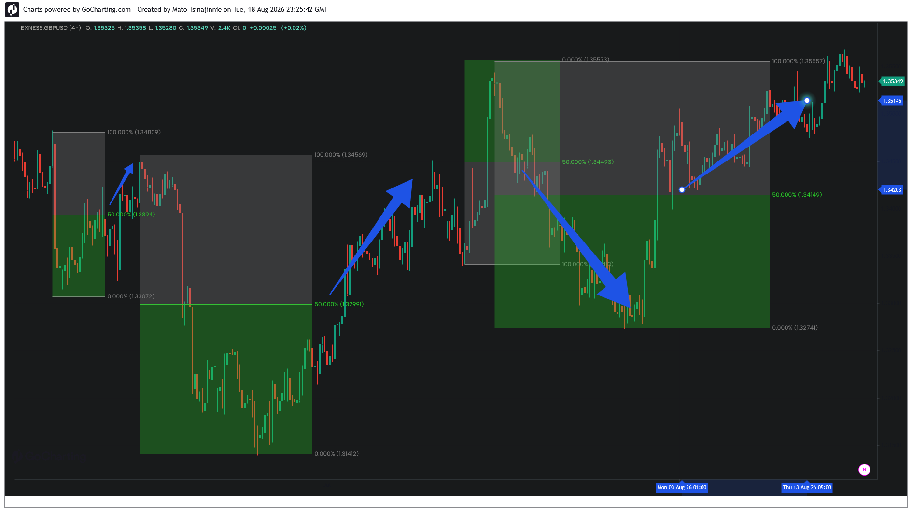

# Case Study 01: GBPUSD — High-Momentum Expansion & Structural Return

## Overview
* **Asset:** GBPUSD (4H)
* **Structural Context:** Interbank Liquidity Delivery Matrix
* **Pattern Type:** Consecutive Expansion Blocks
* **Execution Target:** 50.00% Geometric Center (Equilibrium Level)

## Analysis
The chart illustrates consecutive liquidity expansion vectors. Notice the programmatic price delivery sequences directly into the 50.00% geometric centers (Equilibrium levels) following complex distribution phases designed to clear local retail stop-outs.

The local range matrix demonstrates high-density validation where the market mechanics utilize the precise midpoint of prior impulses as localized reference pivots before initiating the next phase of structural distribution.
