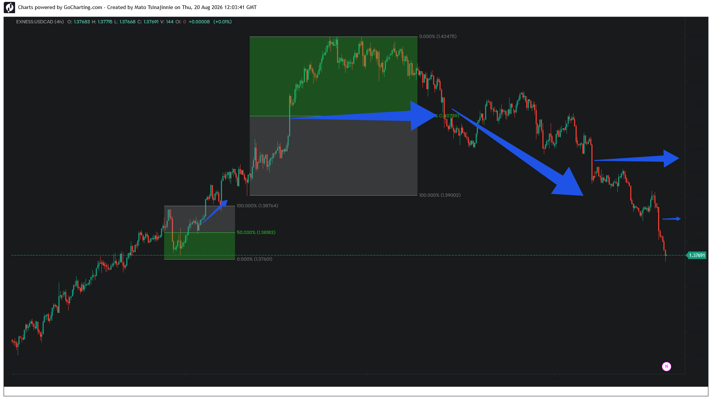

### 📂 Case Study 04: USDCAD — Equilibrium Inversion and Order-Flow Reversal

#### Phase 1: Structural Inversion & Pivot Breakout

#### Phase 2: Cascading Delivery & Target Liquidation (Live Update)

*   **Asset:** USDCAD (4H)
*   **Structural Context:** Failed Trend Continuation Matrix
*   **Pattern Type:** Equilibrium Level Inversion
*   **Execution Target:** 50% Geometric Threshold (1.40739)

**Analysis:**
This case study provides a textbook example of an expansion vector turning into a distribution trap. Following a massive liquidity expansion into the premium parameters (green zone), price engineered a high-density retail breakout narrative. 

Instead of treating the 50% Equilibrium level (1.40739) as standard structural support, the delivery engine achieved a clean programmatic body closure beneath this geometric threshold. This structural inversion validated the exhaustion of buyers, triggering an aggressive order-flow reversal that completely cleared the original expansion's origin liquidity pools at 1.39002.

**Market Evolution (Online Update):**
The live market continuation confirms a massive algorithmic expansion to the downside (long blue diagonal vector) triggered immediately after the 50.00% midpoint (**1.40739**) inverted into active resistance. 

The institutional pricing engine completely dismantled the bull-trend geometry:
1. **Macro Pool Cleared:** Price effortlessly breached the **100.00% macro boundary (1.39002)**, fully exploiting the liquidity gap left by the original expansion vector.
2. **Order-Flow Re-pricing:** Following a minor horizontal mitigation pause (indicated by the right-facing blue arrow), the distribution campaign executed a secondary delivery leg down to the **0.00% baseline level at 1.37608**. 
3. **Current Delivery Stance:** Price action has achieved absolute structural expansion closure, printing strong bearish candles at **1.37691**, which proves that an equilibrium inversion often precedes full macro trend liquidations.
