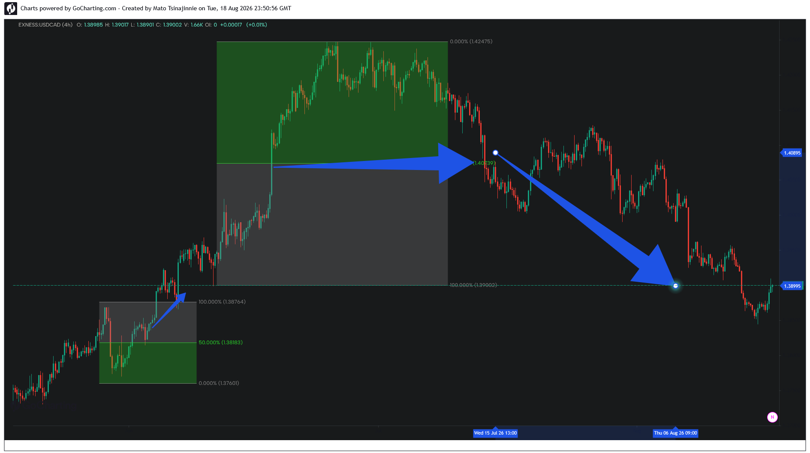

### 📂 Case Study 04: USDCAD — Equilibrium Inversion and Order-Flow Reversal

*   **Asset:** USDCAD (4H)
*   **Structural Context:** Failed Trend Continuation Matrix
*   **Pattern Type:** Equilibrium Level Inversion
*   **Execution Target:** 50% Geometric Threshold (1.40739)

**Analysis:**
This case study provides a textbook example of an expansion vector turning into a distribution trap. Following a massive liquidity expansion into the premium parameters (green zone), price engineered a high-density retail breakout narrative. 

Instead of treating the 50% Equilibrium level (1.40739) as standard structural support, the delivery engine achieved a clean programmatic body closure beneath this geometric threshold. This structural inversion validated the exhaustion of buyers, triggering an aggressive order-flow reversal that completely cleared the original expansion's origin liquidity pools at 1.39002.
