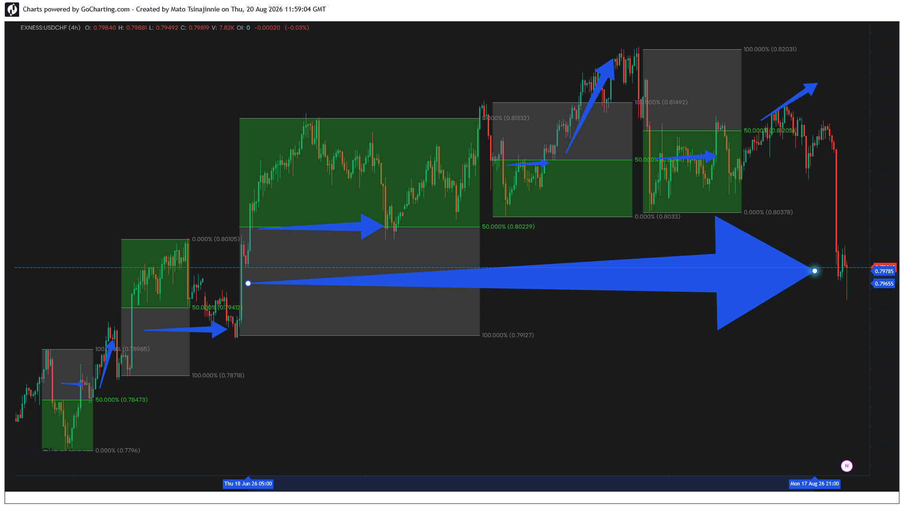

### 📂 Case Study 03: USDCHF — Cascading Liquidity Expansions & Trend Equilibrium

#### Phase 1: Sequential Trend Aggregation

#### Phase 2: Macro Trend Exhaustion & Baseline Return (Live Update)

*   **Asset:** USDCHF (4H)
*   **Structural Context:** Continuous Trend Aggregation
*   **Pattern Type:** Sequential Block Mitigation
*   **Execution Target:** 50% Median Pivots

**Analysis:**
This case study demonstrates the algorithm's performance within a structured, low-volatility trending environment on USDCHF. Rather than executing as isolated macro anomalies, the displacement vectors form a sequential matrix of validation blocks. 

Each subsequent expansion phase initiates only after the price profile mitigates short-term liquidity pools and retests the exact 50% Equilibrium level of the preceding range. The current price delivery on the far right continues to treat the localized midpoint as a high-density pricing pivot, confirming structural dependency across multiple validation cycles.

**Market Evolution (Online Update):**
The live market continuation tracks the complete termination of the multi-stage bullish delivery campaign. After hitting the structural ceiling at the 100.00% expansion parameter of the final premium block (0.82031), buy-side liquidity reached absolute exhaustion. 

The algorithmic engine reacted with an aggressive, high-velocity distribution reversal (indicated by the massive macro blue arrow):
1. **Fractal Collapse:** Price violently invalidated the minor sequential mitigation blocks on the right side, slicing clean through their localized 50.00% midpoints.
2. **Macro Baseline Target:** The rapid downward delivery vector targeted the major historical pivot point originating from the early phase of the structure.
3. **Institutional Liquidation:** Price dropped back to the **0.79619 / 0.79577** zone, fulfilling a full-circle rebalancing campaign and proving that cascading micro-expansions are ultimately bound to major historical macro baselines.
