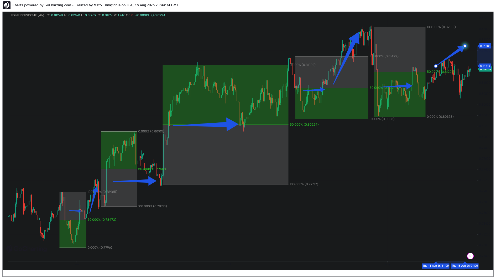

### 📂 Case Study 03: USDCHF — Cascading Liquidity Expansions & Trend Equilibrium

*   **Asset:** USDCHF (4H)
*   **Structural Context:** Continuous Trend Aggregation
*   **Pattern Type:** Sequential Block Mitigation
*   **Execution Target:** 50% Median Pivots

**Analysis:**
This case study demonstrates the algorithm's performance within a structured, low-volatility trending environment on USDCHF. Rather than executing as isolated macro anomalies, the displacement vectors form a sequential matrix of validation blocks. 

Each subsequent expansion phase initiates only after the price profile mitigates short-term liquidity pools and retests the exact 50% Equilibrium level of the preceding range. The current price delivery on the far right continues to treat the localized midpoint as a high-density pricing pivot, confirming structural dependency across multiple validation cycles.
